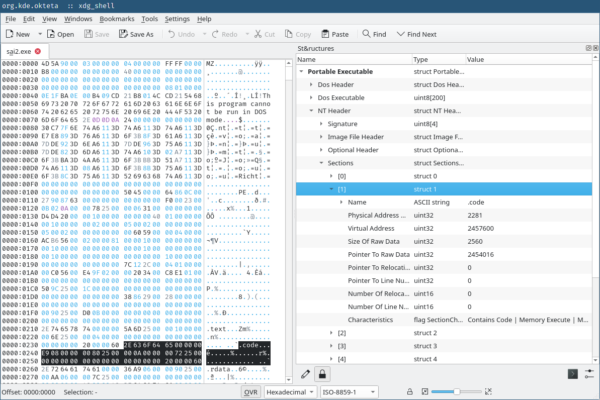

# Portable Executable structure for Okteta
An implementation of the Windows executable (.exe) / Microsoft Portable
Executable format for Okteta's structure view tool.



## Usage
If you want to install from source, you can clone this repository into the right
location and it should be picked up when you restart Okteta.

An example of how you might do this on Linux follows.

```bash
# Create folder in case it does not already exist.
mkdir -p "$HOME/.local/share/okteta/structures/"

# Enter structures folder.
cd "$HOME/.local/share/okteta/structures/"

# Clone into the expected folder.
git clone https://github.com/jchv/okteta-portable-executable portable-executable

# Start/restart Okteta. You should be able to find "Portable Executable
# structure" in the Settings window for the Structure pane.
```

## Features
- Supports PE32 and PE32+ (64-bit) executable files.
- Detailed, human readable field names, enumerations, and flags.
- Automatically locks to offset 0 by default for convenience.
- Supports digging into data directories:
  - Exports table
  - Imports table (partially)
  - Base Relocations (partially)
  - Debug information

## TODO
Some of the data directories are still not handled, including:

- Resources
- CLR descriptors

In addition, due to the lack of support for variable length arrays terminated
by a sentinel value, there are some limitations when digging into various
directories that need this:

- Only the first import thunk for each DLL is parsed.
- Only the first base relocation table is parsed.

Barring a nice hack, it seems likely that we will need to make changes to Okteta
to get better support here. Both of these arrays can get large enough to make it
impractical to try to apply hacks using arrays and nesting.
